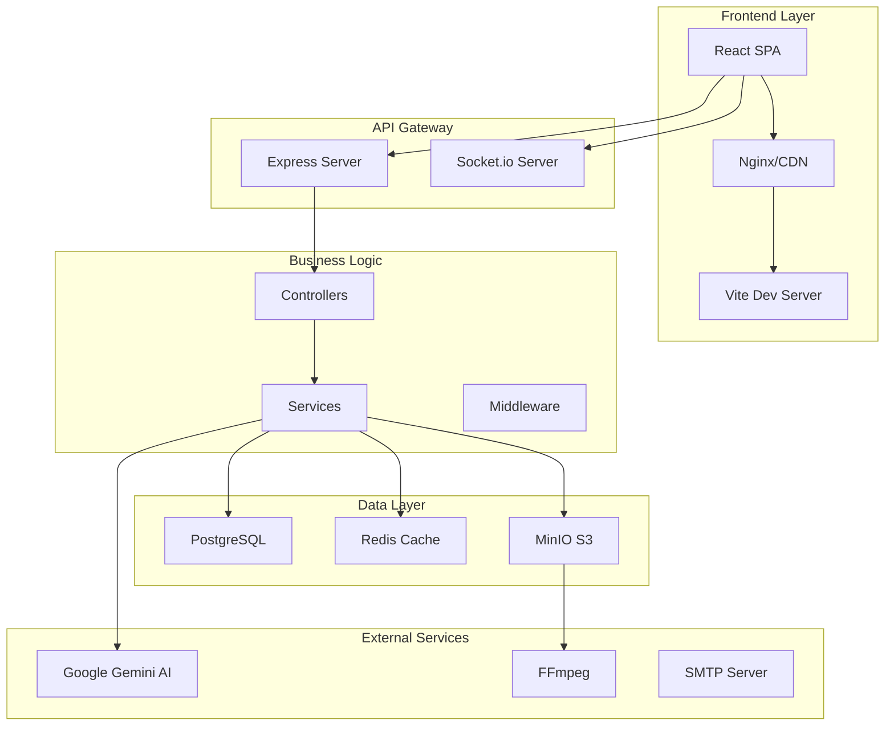
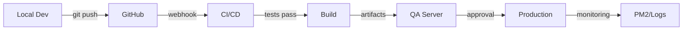

# planning.md - Arquitectura y Stack Técnico
## AristoTest Platform - Technical Blueprint

### 🏗️ ARQUITECTURA DEL SISTEMA



---

## 🔧 STACK TÉCNICO COMPLETO

### Frontend Stack
```yaml
Framework: React 18.2.0
Build Tool: Vite 5.0.10
Language: TypeScript 5.3.3
Styling: Tailwind CSS 3.3.7
State Management: Zustand 4.4.7
Routing: React Router DOM 6.20.1
Forms: React Hook Form 7.48.2 + Zod 4.1.5
Real-time: Socket.io-client 4.6.1
Data Fetching: TanStack Query 5.14.2 + Axios 1.6.2
Charts: Chart.js 4.5.0 + Recharts 2.10.3
Video: Video.js 8.23.4
Animations: Framer Motion 10.18.0
Testing: Vitest 1.1.0 + Testing Library
```

### Backend Stack
```yaml
Runtime: Node.js 18.20.0
Framework: Express 4.18.2
Language: TypeScript 5.3.3
ORM: Sequelize 6.35.0
Database: PostgreSQL 14.9
Cache: Redis/ioredis 5.3.2
WebSocket: Socket.io 4.6.1
Storage: MinIO 8.0.5 (S3-compatible)
AI: Google Generative AI (Gemini) 0.24.1
Video Processing: FFmpeg 2.1.3
Auth: JWT (jsonwebtoken 9.0.2)
Validation: express-validator 7.0.1
Security: Helmet 7.0.0 + bcrypt 6.0.0
Testing: Jest 29.7.0 + Supertest 6.3.3
Process Manager: PM2 5.3.0
```

### DevOps Stack
```yaml
VCS: Git + GitHub
CI/CD: GitHub Actions
Hosting: AWS EC2 + RDS
Container: Docker + Docker Compose
Monitoring: PM2 + Winston Logs
SSL: Let's Encrypt
CDN: CloudFlare (planned)
Backup: AWS S3 + pg_dump
```

---

## 📁 ESTRUCTURA DE DIRECTORIOS

### Estructura Principal
```bash
quiz-app/
├── backend/                    # Servidor Node.js
├── frontend/                   # Aplicación React
├── docker/                     # Configuraciones Docker
├── scripts/                    # Scripts de deployment
├── docs/                       # Documentación adicional
├── .github/                    # GitHub Actions workflows
├── docker-compose.yml          # Orquestación local
├── ecosystem.config.js         # PM2 configuración local
├── ecosystem.prod.config.js    # PM2 configuración producción
├── PRD.md                      # Product Requirements
├── claude.md                   # Reglas para Claude Code
├── planning.md                 # Este archivo
├── tasks.md                    # Lista de tareas
└── CLAUDE.md                   # Especificaciones técnicas
```

### Backend Structure
```bash
backend/
├── src/
│   ├── config/
│   │   ├── database.ts         # Configuración Sequelize
│   │   ├── constants.ts        # Constantes globales
│   │   ├── environment.ts      # Variables de entorno
│   │   └── redis.ts            # Configuración Redis
│   │
│   ├── controllers/            # Controladores (23 archivos)
│   │   ├── authController.ts
│   │   ├── quizController.ts
│   │   ├── sessionController.ts
│   │   ├── videoController.ts
│   │   ├── manualController.ts
│   │   ├── aiController.ts
│   │   └── ...
│   │
│   ├── models/                 # Modelos Sequelize (28 modelos)
│   │   ├── User.ts
│   │   ├── Tenant.ts
│   │   ├── Quiz.ts
│   │   ├── Question.ts
│   │   ├── Manual.ts
│   │   ├── Video.ts
│   │   └── ...
│   │
│   ├── routes/                 # Definición de rutas
│   │   ├── index.ts
│   │   ├── auth.routes.ts
│   │   ├── quiz.routes.ts
│   │   ├── video.routes.ts
│   │   └── ...
│   │
│   ├── services/               # Lógica de negocio (7 servicios)
│   │   ├── geminiService.ts    # Google AI
│   │   ├── minioService.ts     # Storage
│   │   ├── videoService.ts     # FFmpeg
│   │   ├── emailService.ts     # SMTP
│   │   ├── tenantService.ts    # Multi-tenant
│   │   ├── cacheService.ts     # Redis
│   │   └── authService.ts      # JWT
│   │
│   ├── middleware/             # Middleware (7 módulos)
│   │   ├── authMiddleware.ts
│   │   ├── tenantMiddleware.ts
│   │   ├── errorMiddleware.ts
│   │   ├── validationMiddleware.ts
│   │   ├── rateLimitMiddleware.ts
│   │   ├── corsMiddleware.ts
│   │   └── uploadMiddleware.ts
│   │
│   ├── socket/                 # WebSocket handlers
│   │   ├── index.ts
│   │   ├── sessionHandler.ts
│   │   ├── quizHandler.ts
│   │   └── chatHandler.ts
│   │
│   ├── types/                  # TypeScript definitions
│   │   ├── express.d.ts
│   │   ├── models.d.ts
│   │   └── services.d.ts
│   │
│   ├── utils/                  # Utilidades
│   │   ├── logger.ts
│   │   ├── helpers.ts
│   │   ├── validators.ts
│   │   └── constants.ts
│   │
│   └── server.ts               # Entry point
│
├── migrations/                 # Migraciones Sequelize (18 archivos)
├── seeders/                    # Seeders de datos
├── tests/                      # Tests Jest
├── storage/                    # Archivos locales MinIO
├── logs/                       # Logs de aplicación
├── dist/                       # Build de producción
├── .env                        # Variables de entorno
├── .env.example                # Template de variables
├── tsconfig.json               # Configuración TypeScript
├── jest.config.js              # Configuración Jest
├── nodemon.json                # Configuración Nodemon
└── package.json                # Dependencias
```

### Frontend Structure
```bash
frontend/
├── src/
│   ├── pages/                  # Páginas (60 componentes)
│   │   ├── Dashboard/
│   │   ├── Quiz/
│   │   ├── Session/
│   │   ├── Videos/
│   │   ├── Manuals/
│   │   ├── Classroom/
│   │   ├── Admin/
│   │   └── ...
│   │
│   ├── components/             # Componentes reutilizables
│   │   ├── common/
│   │   ├── forms/
│   │   ├── charts/
│   │   ├── modals/
│   │   └── ui/
│   │
│   ├── stores/                 # Estado global Zustand
│   │   ├── authStore.ts
│   │   ├── quizStore.ts
│   │   ├── sessionStore.ts
│   │   ├── videoStore.ts
│   │   └── tenantStore.ts
│   │
│   ├── hooks/                  # Custom hooks
│   │   ├── useAuth.ts
│   │   ├── useSocket.ts
│   │   ├── useQuery.ts
│   │   └── useDebounce.ts
│   │
│   ├── services/               # API services
│   │   ├── api.ts
│   │   ├── authService.ts
│   │   ├── quizService.ts
│   │   └── ...
│   │
│   ├── types/                  # TypeScript types
│   │   ├── models.ts
│   │   ├── api.ts
│   │   └── components.ts
│   │
│   ├── utils/                  # Utilidades
│   │   ├── constants.ts
│   │   ├── helpers.ts
│   │   └── validators.ts
│   │
│   ├── styles/                 # Estilos globales
│   │   └── index.css
│   │
│   ├── App.tsx                 # Componente principal
│   ├── main.tsx               # Entry point
│   └── router.tsx              # Configuración de rutas
│
├── public/                     # Assets estáticos
├── dist/                       # Build de producción
├── .env                        # Variables de entorno
├── vite.config.ts              # Configuración Vite
├── tsconfig.json               # Configuración TypeScript
├── tailwind.config.js          # Configuración Tailwind
├── postcss.config.js           # Configuración PostCSS
└── package.json                # Dependencias
```

---

## 🔐 CONFIGURACIONES IMPORTANTES

### Variables de Entorno Backend (.env)
```bash
# Database
DB_HOST=localhost
DB_PORT=5432
DB_NAME=aristotest
DB_USER=aristotest
DB_PASSWORD=AristoTest2024
DB_POOL_MAX=10
DB_POOL_MIN=2
DB_POOL_ACQUIRE=30000
DB_POOL_IDLE=10000

# Authentication
JWT_SECRET=aristotest-jwt-secret-2024
JWT_REFRESH_SECRET=aristotest-refresh-secret-2024
JWT_EXPIRE=1h
JWT_REFRESH_EXPIRE=7d

# Server
NODE_ENV=development
PORT=3001
HOST=localhost

# CORS
CORS_ORIGIN=http://localhost:5173
SOCKET_CORS_ORIGIN=http://localhost:5173

# Rate Limiting
RATE_LIMIT_MAX_REQUESTS=100
RATE_LIMIT_WINDOW_MS=900000

# Redis (Optional)
REDIS_HOST=localhost
REDIS_PORT=6379
REDIS_PASSWORD=

# MinIO Storage
MINIO_ENDPOINT=localhost
MINIO_PORT=9000
MINIO_USE_SSL=false
MINIO_ACCESS_KEY=aristotest
MINIO_SECRET_KEY=AristoTest2024!
MINIO_BUCKET_NAME=aristotest-videos

# Google Gemini AI
GEMINI_API_KEY=your-gemini-api-key-here

# Email (SMTP)
SMTP_HOST=smtp.gmail.com
SMTP_PORT=587
SMTP_USER=noreply@aristotest.com
SMTP_PASS=your-app-password

# File Upload
MAX_FILE_SIZE=524288000  # 500MB
UPLOAD_DIR=./uploads

# Session
SESSION_SECRET=aristotest-session-secret
SESSION_MAX_AGE=86400000  # 24 hours

# QR Code
QR_BASE_URL=http://localhost:5173/join

# Logging
LOG_LEVEL=debug
LOG_FILE=./logs/app.log
```

### Variables de Entorno Frontend (.env)
```bash
# API Configuration
VITE_API_URL=http://localhost:3001
VITE_SOCKET_URL=http://localhost:3001

# Environment
VITE_ENV=development

# Features Flags
VITE_ENABLE_AI=true
VITE_ENABLE_VIDEO=true
VITE_ENABLE_ANALYTICS=true

# Third Party
VITE_GA_TRACKING_ID=
VITE_SENTRY_DSN=

# Storage
VITE_MINIO_URL=http://localhost:9000
```

### Puertos y Servicios
```yaml
Backend API: 3001
Frontend Dev: 5173
PostgreSQL: 5432
Redis: 6379
MinIO API: 9000
MinIO Console: 9001
Socket.io: 3001 (compartido con API)
```

### Credenciales de Desarrollo
```yaml
PostgreSQL:
  Local:
    User: aristotest
    Password: AristoTest2024
    Database: aristotest

  QA/Production (AWS RDS):
    Host: ec2-3-91-26-178.compute-1.amazonaws.com
    User: labsis
    Password: ',U8x=]N02SX4'
    Database: aristotest1

MinIO:
  User: aristotest
  Password: AristoTest2024!

Admin User (seed):
  Email: admin@aristotest.com
  Password: Admin123!

Demo Users (seed):
  Teacher: teacher@demo.com / Teacher123!
  Student: student@demo.com / Student123!
```

---

## 🎯 PATRONES Y CONVENCIONES

### Nomenclatura de Archivos
```bash
# Componentes React
PascalCase.tsx         # ComponentName.tsx
PascalCase.test.tsx    # ComponentName.test.tsx

# Servicios y utilidades
camelCase.ts           # serviceName.ts

# Rutas API
kebab-case.routes.ts   # quiz-session.routes.ts

# Modelos
PascalCase.ts          # UserModel.ts

# Migraciones
YYYYMMDDHHMMSS-description.js  # 20240920143000-create-users.js
```

### Estructura de Componentes React
```typescript
// 1. Imports
import React, { FC, useState, useEffect } from 'react';
import { useNavigate } from 'react-router-dom';

// 2. Types/Interfaces
interface Props {
  // Props definition
}

// 3. Component
export const Component: FC<Props> = (props) => {
  // 4. Hooks
  const navigate = useNavigate();
  const [state, setState] = useState();

  // 5. Effects
  useEffect(() => {
    // Effect logic
  }, []);

  // 6. Handlers
  const handleClick = () => {
    // Handler logic
  };

  // 7. Render helpers
  const renderContent = () => {
    return <div>Content</div>;
  };

  // 8. Main render
  return (
    <div className="container">
      {renderContent()}
    </div>
  );
};

// 9. Export
export default Component;
```

### Estructura de API Endpoints
```typescript
// Naming convention
GET    /api/v1/resources          // List
GET    /api/v1/resources/:id      // Get one
POST   /api/v1/resources          // Create
PUT    /api/v1/resources/:id      // Update
DELETE /api/v1/resources/:id      // Delete

// Con tenant isolation
GET    /api/v1/tenants/:tenantId/resources
POST   /api/v1/tenants/:tenantId/resources

// Acciones especiales
POST   /api/v1/resources/:id/action
GET    /api/v1/resources/:id/related
```

### Manejo de Errores
```typescript
// Backend error class
class AppError extends Error {
  constructor(
    public message: string,
    public statusCode: number,
    public isOperational = true
  ) {
    super(message);
    Object.setPrototypeOf(this, AppError.prototype);
  }
}

// Uso
throw new AppError('Resource not found', 404);

// Frontend error handling
try {
  const data = await api.get('/resource');
} catch (error) {
  if (error.response?.status === 401) {
    // Handle auth error
    authStore.logout();
  } else {
    // Show toast notification
    toast.error(error.message);
  }
}
```

### Logging Standards
```typescript
// Niveles de log
logger.error('Error message', { error, context });
logger.warn('Warning message', { data });
logger.info('Info message', { action, user });
logger.debug('Debug message', { details });

// Formato de logs
{
  timestamp: '2024-09-20T10:30:00Z',
  level: 'error',
  message: 'Database connection failed',
  context: {
    service: 'authService',
    method: 'login',
    userId: '123',
    tenantId: '456',
    error: {
      message: 'Connection timeout',
      stack: '...'
    }
  }
}
```

---

## 🚀 SCRIPTS DE DEPLOYMENT

### Scripts Disponibles
```bash
# Desarrollo local
./scripts/start-dev.sh          # Inicia todos los servicios locales
./scripts/reset-db.sh            # Resetea base de datos local
./scripts/start-minio.sh         # Inicia MinIO server

# QA Deployment
./deploy-qa-v2-option1-clean.sh    # Deployment limpio
./deploy-qa-v2-option2-update.sh   # Actualización incremental
./deploy-qa-v2-option3-docker.sh   # Deployment con Docker

# Producción
./deploy-aristotest-from-github.sh # Deploy desde GitHub
./deploy-fix.sh                    # Arregla problemas comunes
./emergency-restart.sh             # Restart de emergencia

# Mantenimiento
./fix-backend-final.sh             # Arregla backend
./fix-typescript-issue.sh          # Arregla TypeScript
./fix-remote-backend.sh            # Arregla backend remoto
```

### Proceso de Deployment


---

## 📊 MODELO DE DATOS

### Esquema Principal (38 tablas)
```sql
-- Tablas Core Multi-tenant
tenants                 -- Organizaciones cliente
users                   -- Usuarios del sistema
roles                   -- Roles de usuario
permissions             -- Permisos del sistema
role_permissions        -- Relación roles-permisos

-- Tablas de Quizzes
quizzes                 -- Plantillas de quiz
questions               -- Preguntas
question_options        -- Opciones de respuesta
quiz_sessions           -- Sesiones activas
participants            -- Participantes de sesión
answers                 -- Respuestas de participantes
session_results         -- Resultados consolidados

-- Tablas de Contenido Educativo
manuals                 -- Documentos PDF
manual_chats           -- Historial de chat con IA
manual_summaries       -- Resúmenes generados
study_guides           -- Guías de estudio
flash_cards            -- Tarjetas de memorización
ai_generated_quizzes   -- Quizzes generados por IA

-- Tablas de Videos
videos                      -- Contenido de video
video_transcriptions        -- Transcripciones
interactive_video_layers    -- Capas interactivas
interactive_video_questions -- Preguntas en video
interactive_video_results   -- Resultados de video

-- Tablas de Formación
classrooms              -- Salones virtuales
classroom_enrollments   -- Inscripciones
training_programs       -- Programas de formación
program_quizzes        -- Quizzes de programa
certificates           -- Certificados
certificate_templates  -- Plantillas de certificado

-- Tablas de Sistema
audit_logs             -- Logs de auditoría
notifications          -- Notificaciones
settings               -- Configuraciones
migrations             -- Control de migraciones
sessions               -- Sesiones de usuario
```

### Relaciones Clave
```yaml
Multi-tenant:
  - Todas las tablas principales tienen tenant_id
  - Aislamiento automático por Sequelize hooks
  - Índices en tenant_id para performance

Relaciones 1:N:
  - tenant -> users
  - user -> quizzes
  - quiz -> questions
  - question -> options
  - manual -> summaries
  - video -> interactive_layers

Relaciones N:M:
  - users <-> roles
  - roles <-> permissions
  - classrooms <-> students
  - programs <-> quizzes
```

---

## 🔒 SEGURIDAD Y COMPLIANCE

### Medidas de Seguridad
```yaml
Autenticación:
  - JWT con refresh tokens
  - Bcrypt para passwords (salt rounds: 10)
  - Session timeout: 24 horas
  - Refresh token rotation

Autorización:
  - RBAC (Role-Based Access Control)
  - Tenant isolation automática
  - Middleware de validación
  - Rate limiting por IP

Encriptación:
  - TLS 1.3 para transmisión
  - AES-256 para datos sensibles
  - Secrets en variables de entorno
  - No logs de datos sensibles

Validación:
  - express-validator en todas las rutas
  - Sanitización de inputs
  - Prevención de SQL injection
  - XSS protection con Helmet

Auditoría:
  - Logs de todas las acciones críticas
  - Tracking de cambios en datos
  - Retention de 90 días
  - Análisis de anomalías
```

### Compliance
```yaml
GDPR:
  - Derecho al olvido implementado
  - Exportación de datos personales
  - Consentimiento explícito
  - Política de privacidad

CCPA:
  - Opt-out de venta de datos
  - Transparencia en uso de datos
  - Eliminación bajo petición

SOC 2:
  - Controles de seguridad
  - Monitoreo continuo
  - Respaldos automatizados
  - Plan de recuperación
```

---

## 📈 PERFORMANCE Y OPTIMIZACIÓN

### Estrategias de Optimización
```yaml
Frontend:
  - Code splitting por rutas
  - Lazy loading de componentes
  - Memoización con React.memo
  - Virtual scrolling para listas largas
  - Service workers para cache
  - Compresión gzip/brotli
  - CDN para assets estáticos

Backend:
  - Connection pooling (max: 10)
  - Query optimization con índices
  - Caching con Redis (TTL: 1h)
  - Pagination en todas las listas
  - Batch processing para bulk operations
  - Queue system para tareas pesadas
  - Horizontal scaling con PM2

Database:
  - Índices en foreign keys
  - Índices compuestos para queries comunes
  - Partitioning por tenant (futuro)
  - Vacuum automático
  - Query plan analysis
  - Connection limits por tenant
```

### Métricas Target
```yaml
Performance:
  - First Contentful Paint: < 1.5s
  - Time to Interactive: < 3.5s
  - Largest Contentful Paint: < 2.5s
  - Cumulative Layout Shift: < 0.1
  - API Response Time P95: < 200ms
  - WebSocket Latency: < 100ms

Escalabilidad:
  - Concurrent Users: 10,000
  - Requests per Second: 1,000
  - Database Connections: 100
  - Storage per Tenant: 10GB
  - Video Streaming: 500 concurrent
```

---

## 🔄 INTEGRACIÓN CONTINUA

### Pipeline CI/CD
```yaml
Stages:
  1. Code Analysis:
     - ESLint
     - TypeScript check
     - Security scan

  2. Testing:
     - Unit tests (Jest)
     - Integration tests
     - E2E tests (Cypress)

  3. Build:
     - Frontend build (Vite)
     - Backend build (Babel)
     - Docker images

  4. Deploy:
     - QA environment
     - Staging
     - Production (manual approval)

  5. Post-Deploy:
     - Smoke tests
     - Performance tests
     - Rollback if needed
```

### GitHub Actions Workflow
```yaml
name: CI/CD Pipeline

on:
  push:
    branches: [main, develop]
  pull_request:
    branches: [main]

jobs:
  test:
    runs-on: ubuntu-latest
    steps:
      - uses: actions/checkout@v2
      - uses: actions/setup-node@v2
      - run: npm ci
      - run: npm test
      - run: npm run lint

  build:
    needs: test
    runs-on: ubuntu-latest
    steps:
      - run: npm run build
      - uses: actions/upload-artifact@v2

  deploy:
    needs: build
    if: github.ref == 'refs/heads/main'
    runs-on: ubuntu-latest
    steps:
      - run: ./deploy-prod.sh
```

---

## 📚 RECURSOS Y DOCUMENTACIÓN

### Documentación Interna
- [PRD.md](./PRD.md) - Requisitos del producto
- [claude.md](./claude.md) - Reglas para Claude Code
- [tasks.md](./tasks.md) - Lista de tareas
- [CLAUDE.md](./CLAUDE.md) - Especificaciones técnicas
- [README.md](./README.md) - Documentación general

### Documentación Externa
- [React Docs](https://react.dev/)
- [TypeScript Handbook](https://www.typescriptlang.org/docs/)
- [Sequelize Docs](https://sequelize.org/docs/v6/)
- [Socket.io Docs](https://socket.io/docs/v4/)
- [Tailwind CSS](https://tailwindcss.com/docs)
- [Google Gemini API](https://ai.google.dev/)

### Herramientas de Desarrollo
- **IDE:** VSCode con extensiones TypeScript, ESLint, Prettier
- **API Testing:** Postman/Insomnia
- **DB Client:** pgAdmin/TablePlus
- **Git GUI:** SourceTree/GitKraken
- **Monitoring:** PM2 Web Dashboard

---

## 🎯 PRINCIPIOS DE ARQUITECTURA

1. **Separation of Concerns:** Capas bien definidas
2. **DRY (Don't Repeat Yourself):** Código reutilizable
3. **SOLID Principles:** Diseño orientado a objetos
4. **KISS (Keep It Simple):** Soluciones simples primero
5. **YAGNI (You Aren't Gonna Need It):** No sobre-engineerear
6. **Fail Fast:** Validación temprana
7. **Defensive Programming:** Asumir que todo puede fallar
8. **Progressive Enhancement:** Core funcional, mejoras opcionales

---

*Este documento es el plano técnico maestro de AristoTest. Manténlo actualizado con cada cambio arquitectural significativo.*

**Última actualización:** 2025-09-20
**Versión:** 1.0.0
**Mantenedor:** Equipo de Desarrollo AristoTest